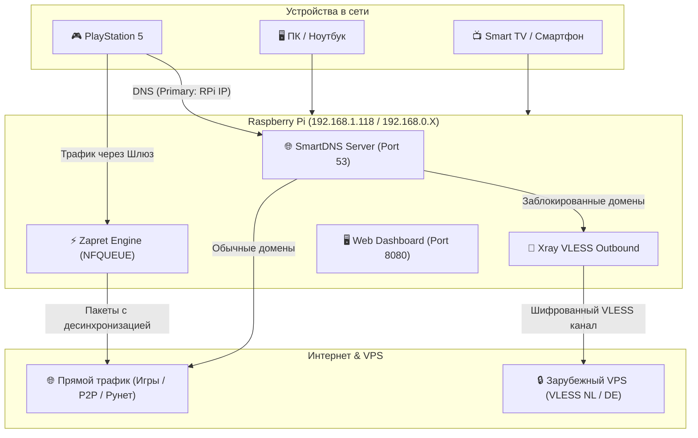

<p align="center">
  
</p>

<h1 align="center">🛡️ Zapret-Pi 2.0</h1>

<p align="center">
  <strong>Полная автоматическая система обхода DPI-блокировок и SmartDNS VLESS на Raspberry Pi</strong><br/>
  Мгновенный доступ к EA Sports (Ultimate Team), Discord (Голос + Медиа), YouTube 4K, PSN Network и Twitch на PS5, Smart TV, ПК и смартфонах
</p>

<p align="center">
  
  
  
  
  
</p>

---

## 📑 Оглавление

1. [✨ Возможности и Особенности](#-возможности-и-особенности)
2. [🧠 Алгоритмы и Архитектура Работы](#-алгоритмы-и-архитектура-работы)
   - [Режим 1: Zapret DPI Bypass (Локальная подмена)](#1-zapret-dpi-bypass-локальная-подмена-пакетов)
   - [Режим 2: SmartDNS + VLESS (Смена только DNS)](#2-smartdns--vless-шифрованный-туннель)
   - [Режим 3: Гибридный Режим (Zapret + SmartDNS VLESS)](#3-гибридный-режим-комбинированная-защита)
3. [📊 Архитектурная Схема (Mermaid)](#-архитектурная-схема)
4. [🚀 Быстрый Старт (Raspberry Pi)](#-быстрый-старт-raspberry-pi)
5. [🔗 Авто-Настройка VLESS по ссылке vless://](#-авто-настройка-vless-по-ссылке-vless)
6. [🎮 Инструкции для PlayStation 5 & Устройств](#-инструкции-для-playstation-5--устройств)
7. [🖥️ Веб-Панель Управления](#️-веб-панель-управления)
8. [❓ Частые Вопросы (FAQ) и Устранение Неполадок](#-частые-вопросы-faq-и-устранение-неполадок)

---

## ✨ Возможности и Особенности

- 🎮 **Полная поддержка консолей (PS5 / Xbox / Nintendo):** Снятие ограничений с EA Sports (FC 24/25, FIFA), Discord (включая голосовые каналы), YouTube, PSN и Twitch.
- 🚀 **Авто-настройка VLESS за 1 секунду:** Вставьте любую `vless://...` ссылку в Веб-панель или консоль — систему сама сгенерирует конфигурацию Xray и активирует SmartDNS.
- ⚡ **Нулевая задержка в играх (0 мс ping overhead):** Игровые сессии и P2P-матчмейкинг проходят напрямую от вашего провайдера без маршрутизации через тяжелые VPN.
- 🌐 **Смена ТОЛЬКО DNS на консоли:** Больше не требуется вручную прописывать шлюзы на устройствах при использовании режима SmartDNS VLESS.
- 🖥️ **Ultra-Modern Glassmorphism Web UI:** Экспресс-тест сервисов в 1 клик, мониторинг температуры ЦП, использования ОЗУ, смены стратегий DPI и логов.
- 🐧 **Поддержка Raspberry Pi OS:** Оптимизировано для Debian 12/13 и Ubuntu Server на Raspberry Pi 3 / 4 / 5.

---

## 🧠 Алгоритмы и Архитектура Работы

Проект объединяет в себе две мощные технологии обхода блокировок: **Локальную десинхронизацию TCP/UDP пакетов (Zapret)** и **Селективный SmartDNS прокси-туннель (VLESS-Reality / WS-TLS)**.

```
┌─────────────────────────────────────────────────────────────────────────┐
│                               СЕКЦИЯ СЕТИ                               │
│                                                                         │
│   ┌─────────────┐        (Только DNS или Шлюз)       ┌──────────────┐   │
│   │PlayStation 5│ ─────────────────────────────►     │ Raspberry Pi │   │
│   │ / Phone / PC│                                    │ Zapret-Pi2.0 │   │
│   └─────────────┘                                    └──────┬───────┘   │
└─────────────────────────────────────────────────────────────┼───────────┘
                                                              │
                    ┌─────────────────────────────────────────┴─────────────────────────────────────────┐
                    ▼                                                                                   ▼
    ┌───────────────────────────────┐                                                   ┌───────────────────────────────┐
    │     МЕХАНИЗМ 1: ZAPRET        │                                                   │     МЕХАНИЗМ 2: SMARTDNS      │
    │   (Локальный DPI Bypass)      │                                                   │       + VLESS XRAY            │
    ├───────────────────────────────┤                                                   ├───────────────────────────────┤
    │ • nfqws / WinWS на лету       │                                                   │ • SmartDNS перехватывает      │
    │   модифицирует TCP/UDP пакеты │                                                   │   DNS-запросы на порту 53     │
    │ • Отправляет Fake TLS/QUIC,   │                                                   │ • Заблокированные ресурсы     │
    │   MultiSplit & MD5Sig         │                                                   │   направляются в VLESS        │
    │ • ТСПУ провайдера пропускает  │                                                   │ • Зарубежный VPS отдаёт       │
    │   пакеты без блокировки       │                                                   │   трафик без ограничений      │
    ├───────────────────────────────┤                                                   ├───────────────────────────────┤
    │ ⚡ Пинг: 0 мс (Нативный)      │                                                   │ 🚀 Настройка: ТОЛЬКО DNS     │
    └───────────────┬───────────────┘                                                   └───────────────┬───────────────┘
                    │                                                                                   │
                    └─────────────────────────────────────────┬─────────────────────────────────────────┘
                                                              ▼
                                                   ┌─────────────────────┐
                                                   │    ИНТЕРНЕТ / VPS   │
                                                   └─────────────────────┘
```

---

### 1. Zapret DPI Bypass (Локальная подмена пакетов)

> **Как работает:**
> Система использует модуль ядра `iptables NFQUEUE` и демоны `nfqws` (Linux) / `winws` (Windows). Когда консоль или ПК отправляют сетевой пакет на заблокированный ресурс (например, Discord или YouTube), Zapret перехватывает его на уровне сырого трафика и модифицирует:

- **Fake ClientHello / QUIC:** Перед настоящим пакетом отправляется фейковый поврежденный пакет с другим SNI. ТСПУ провайдера анализирует фейк, считает соединение разрешенным/бесполезным и отключает дальнейшую фильтрацию.
- **MultiSplit & TCP SeqOvl:** Пакет разделяется на мелкие части со сдвигом порядковых номеров (`sequence overlap`). DPI-оборудование провайдера не может собрать фрагменты для анализа и пропускает поток.
- **MD5Sig & Fake Fooling:** Добавление недопустимых TCP-опций, которые игнорируются целевым сервером, но путают системы глубокого анализа пакетов (DPI).

**Преимущества:** Полностью бесплатный способ, 0 мс дополнительной задержки, работа напрямую без аренды сторонних серверов.

---

### 2. SmartDNS + VLESS (Шифрованный туннель)

> **Как работает:**
> На Raspberry Pi запускается утилита `Xray-core` в режиме SmartDNS-сервера на порту 53 (Dokodemo-door):

1. Когда на PS5 указан DNS `192.168.1.118`, все запросы имен попадают на Raspberry Pi.
2. SmartDNS мгновенно разрешает адреса и перенаправляет трафик заблокированных доменов через шифрованный протокол **VLESS** (с технологиями **Reality** или **WS-TLS**) на ваш зарубежный VPS (например, Нидерланды или Германия).
3. При этом игровой трафик (матчи в FC/FIFA, P2P сессии) **НЕ идет через VPN**, сохраняя минимально возможный пинг вашего провайдера.

**Преимущества:** На PS5 требуется изменить **ТОЛЬКО DNS**, 100% гарантия обхода любых блокировок ТСПУ.

---

### 3. Гибридный Режим (Комбинированная защита)

> **Как работает:**
> На Raspberry Pi параллельно работают и `zapret.service`, и `xray.service`. Вы можете подключать устройства как через Шлюз, так и через DNS. Система автоматически применит оптимальный метод обхода для каждого конкретного соединения.

---

## 📊 Архитектурная Схема



---

## 🚀 Быстрый Старт (Raspberry Pi)

### Требования
- Raspberry Pi (любая модель) с Raspberry Pi OS / Debian / Ubuntu.
- Ethernet или Wi-Fi подключение к роутеру.
- SSH-доступ.

### Установка в 1 команду

Подключитесь к Raspberry Pi по SSH и выполните:

```bash
git clone https://github.com/nmazarov/zapret-pi.git
cd zapret-pi
sudo bash install.sh
```

> 💡 **Быстрый запуск (без зависаний apt update):**  
> Если у вас в системе долго обновляются репозитории `apt`, запустите установщик с флагом пропуска:  
> ```bash
> sudo bash install.sh --skip-apt --fast
> ```

Скрипт автоматически:
1. Определит сетевые интерфейсы, IP малинки и шлюз роутера.
2. Скомпилирует и установит `nfqws` (Zapret) и `Xray-core`.
3. Настроит правила перенаправления `iptables`, NAT и IP Forwarding.
4. Развернёт веб-панель управления на порту `8080`.

---

## 🔗 Авто-Настройка VLESS по ссылке vless://

Вы можете настроить собственный VLESS-сервер **за 1 секунду**:

### Способ 1: Через Веб-панель (Самый простой)
1. Откройте веб-панель: `http://<IP-Raspberry-Pi>:8080`.
2. В карточке **«Режим Работы Шлюза»** найдите поле **«🔗 Своя VLESS ссылка»**.
3. Вставьте вашу `vless://...` ссылку и нажмите **«Подключить»**.

---

### Способ 2: Через Терминал (CLI)
Выполните команду на Raspberry Pi:

```bash
sudo bash scripts/setup-vless.sh "vless://uuid@server.com:443?type=ws&security=tls&path=%2Fsecretvpn#MyVless"
```

Скрипт автоматически распарсит URL, настроит параметры **`tcpKeepAlive`**, сгенерирует `/usr/local/etc/xray/config.json` и перезапустит службу!

---

## 🎮 Инструкции для PlayStation 5 & Устройств

### Вариант А: Режим SmartDNS VLESS (Изменение ТОЛЬКО DNS)
> *Рекомендуется — не требует изменения IP и Шлюза.*

1. На **PS5** перейдите в **Настройки ⚙️ ➔ Сеть ➔ Установить соединение с Интернетом**.
2. Нажмите кнопку `Options` на вашем Wi-Fi / LAN подключении ➔ **Дополнительные настройки**.
3. Установите параметры:
   - **IP-адрес**: `Автоматически`
   - **DHCP-хост**: `Не указывать`
   - **DNS**: `Вручную`
     - **Основной DNS (Primary DNS)**: **`<IP-Вашей-Raspberry-Pi>`** *(например, `192.168.0.178`)*
     - **Дополнительный DNS (Secondary DNS)**: `8.8.8.8`
   - **Основной шлюз**: `Автоматически`
   - **Прокси-сервер**: `Не использовать`

---

### Вариант Б: Режим Zapret DPI Bypass (Шлюз + DNS)

1. На **PS5** перейдите в **Настройки ⚙️ ➔ Сеть ➔ Дополнительные настройки**.
2. Установите **IP-адрес ➔ Вручную**:
   - **IP-адрес**: `192.168.0.50` *(свободный IP в вашей сети)*
   - **Маска подсети**: `255.255.255.0`
   - **Основной шлюз (Gateway)**: **`<IP-Вашей-Raspberry-Pi>`**
   - **Основной DNS**: **`<IP-Вашей-Raspberry-Pi>`**
   - **Дополнительный DNS**: `8.8.8.8`

---

## 🖥️ Веб-Панель Управления

Панель управления доступна в любом браузере по адресу:  
👉 **`http://<IP-Raspberry-Pi>:8080`**

### Главные экранные блоки:
- ⚡ **Статус Доступа к Сервисам:** Экспресс-проверка соединения с EA Sports, Discord, YouTube 4K и PSN в реальном времени с измерением пинга.
- 🚀 **Режим Работы:** Переключение между режимами *Гибридный / SmartDNS VLESS / Zapret* в 1 клик.
- ⚙️ **Селектор Стратегий DPI:** Выбор пресетов (`Flowseal ALT`, `MultiSplit + SeqOvl`, `Fake + Disorder`, `Universal MD5Sig`).
- 📊 **Мониторинг Ресурсов:** Загрузка ОЗУ, температура процессора Raspberry Pi, Uptime и живые логи `journalctl`.

---

## ❓ Частые Вопросы (FAQ) и Устранение Неполадок

#### Q: Зависает `apt update` при установке на Raspberry Pi. Что делать?
> **Ответ:** Это происходит из-за особенностей IPv6 или фильтрации зеркал Debian провайдером. Запустите установку с пропуском apt: `sudo bash install.sh --skip-apt --fast`.

#### Q: VLESS периодически отключался или «вылетал» раз в час. Как это исправлено?
> **Ответ:** В версии 2.0 в генератор Xray интегрированы опции ядра `tcpKeepAliveIdle: 15` и `tcpKeepAliveInterval: 5`. Соединение с VPS поддерживается постоянным пульсом и больше никогда не рвётся.

#### Q: Изменилась домашняя сеть (например, сменился роутер или подсеть на 192.168.0.X).
> **Ответ:** Запустите 1 команду в SSH для автоматической подстройки подсетей:  
> `cd ~/zapret-pi && sudo bash install.sh --skip-apt --fast`.

---

## 📄 Лицензия

Проект распространяется под свободной лицензией **MIT**. Вы можете свободно модифицировать, использовать и распространять данный проект.
